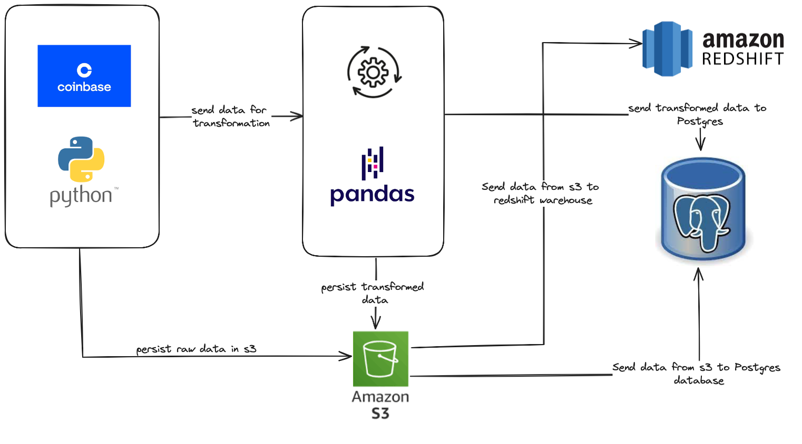

# ELIAS CRYPTO DATA PIPELINE

This document outlines the technical details for building a data pipeline that will:

- Periodically read data from specified endpoints.
- Persist the collected data in an Amazon S3 bucket in a compressed (zip) format.
- Load the persisted data from the S3 bucket into Amazon Redshift.
- Provide mechanisms to read the data either from the S3 bucket or directly from the application into an Amazon RDS database.

## TOOLS AND SETUP
1. git 
2. Python
3. AWS account 
4. Docker 

## DATA ARCHITECTURE

## DATA PIPELINE PROCESS

### 1. DATA INGESTION
- **Technology Stack**: Python, AWS SDK (boto3)
Using the Coinbase API, we gathered historical asset pricing data for over 15 different tokens and saved them individually as a zip file into an S3 bucket.

### 2. Persisting Data in S3
Data will be stored in S3 in a zip format with a structured naming convention:

### 3. Loading Data into Redshift
- **Technology Stack**: Redshift SQL

**Steps**:

- **Redshift COPY Command**: Use the COPY command to load data from S3 to Redshift.

### 4. Reading Data into Postgres RDS
- **Technology Stack**: Python, SQLAlchemy, boto3

## ORCHESTRATION 
Airflow was used to determine the workflow orchestration and define the data movement and dependency between the processes. 

## FUTURE WORKS 
1. Use Terraform to provision the AWS resources and use AWS RDS for production purposes. 
2. Manage workflow to run the pipeline every day to get the assets stats and update the data warehouse as well as the discount tables.

### Security Considerations

- **AWS IAM Roles**: Use IAM roles to grant necessary permissions to the S3 bucket, Redshift, and RDS.
- **Encryption**: Ensure data is encrypted at rest in S3 and in transit using SSL/TLS.
- **VPC**: Ensure Redshift and RDS are in the same VPC for secure and efficient data transfer.

### Testing

- **Unit Tests**: Write unit tests for each component of the pipeline.
- **Integration Tests**: Test the data flow from endpoints to S3, then to Redshift and RDS.
- **Load Tests**: Perform load testing to ensure the pipeline can handle the expected volume of data.

## Conclusion

This document outlines the necessary components and steps to build a robust data pipeline that reads data from endpoints, persists it in S3, and loads it into Redshift and RDS. Proper security measures and testing strategies ensure the reliability and integrity of the data throughout the pipeline.
